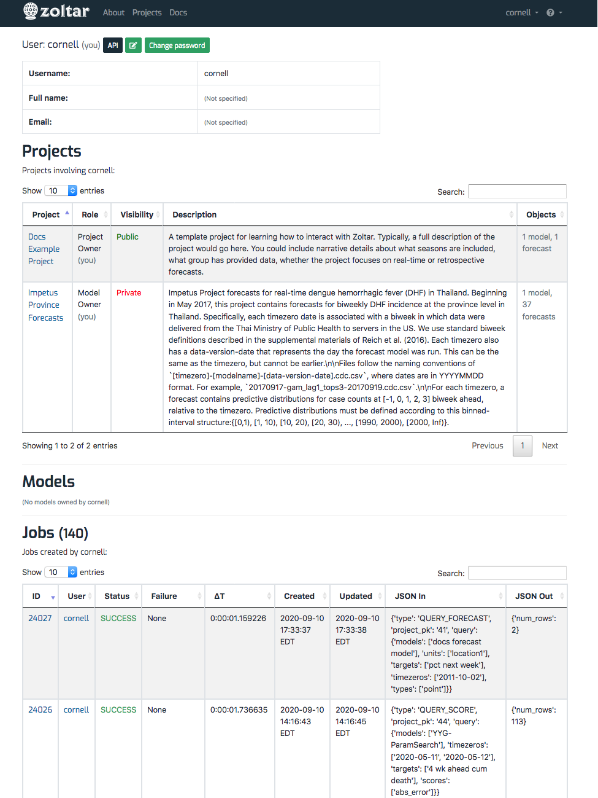

# Managing your account

Zoltar provides some basic features for managing your account, which this page describes. Note that you must have a Zoltar account to do anything other than browse public repositories. If you want an account or need to delete one, please use the [contact information](index.md#contact).

## View your profile page

Account features are accessed via the user dropdown menu in the black [navigation header](HomePage.md#navigation header) that's shown at the top of all pages:

Selecting "Profile Page" takes you to details about your account:

From this page you can use the buttons at the top to edit your email address and name, and to change your password. In addition, you'll see sections for the **Projects** you're involved with (either as a project owner or model owner), the **Models** you own, and the **[Jobs](Jobs.md)** you have created.

## Reset your password

Zoltar has a basic "amnesia" feature in case you forget your password. To use it:

1. Click the "Sign in" user dropdown menu in the black [navigation header](HomePage.md#navigation header) that's shown at the top of all pages.
1. On the user login page, click the "Lost password?" link.
1. Follow the instructions that are sent to the email address you registered with Zoltar.
