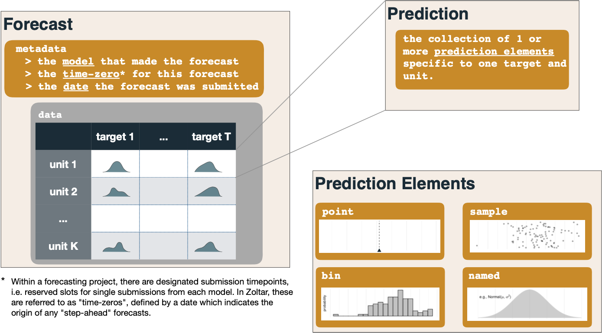

# Zoltar data model

This page documents how Zoltar represents forecast data, and the various types of _predictions_ that are supported. Each forecast is made for a particular _time zero_ in the project, and contains some number of _predictions_, one or more for each combination of the project's _units_ and _targets_. Zoltar supports the following five prediction types, which we've found covers many forecasting applications. All predictions must pass a number of validity checks as documented in [Validation](Validation.md). Each section has an example as represented in Zoltar's [JSON format](FileFormats.md#forecast-data-file-format-json) which was taken from the "Docs Example Project" demo project.

## Overview

(Please refer to the diagram below.) A forecast is made up of metadata (the _model_ that made the forecast, the _time zero_ for the forecast, and the forecast's date of submission) plus the forecast's data as a set of _predictions_. Each prediction is a collection of one or more _prediction elements_ specific to one target and unit. Each prediction element is of a particular type (point, named, bin, sample, and quantile, as described below).

## Point predictions

Point predictions represent a single value. See [here](Validation.md#point-prediction-elements) for details. In this example we see a prediction of `2.1` for the unit "location1" and target "pct next week". Note that, like all predictions, the data type (in this case the float `2.1`) must match the target's data type. (In this case it does; "pct next week" is a _discrete_ target.)

    {"unit": "location1",
      "target": "pct next week",
      "class": "point",
      "prediction": {
        "value": 2.1
      }
    }

## Named distributions

Named distributions represent distributions like _normal_, _log normal_, _gamma_, etc. See [here](Validation.md#named-prediction-elements) for details. Here is an example in which a _normal_ distribution ("norm" is the abbreviation) is specified for unit "location1" and target "pct next week". Named predictions support up to three parameters (named "param1", "param2", and "param3") depending on the family. Here the normal distribution requires two parameters: _mean_ ("param1") and _sd_ ("param2"). "param3" is unused and not listed.

    {"unit": "location1",
      "target": "pct next week",
      "class": "named",
      "prediction": {
        "family": "norm",
        "param1": 1.1,
        "param2": 2.2
      }
    }

## Bin distributions

Bin distributions represent binned distribution defined by inclusive lower bounds for each bin. See [here](Validation.md#bin-prediction-elements) for details. Example:

    {"unit": "location2",
      "target": "pct next week",
      "class": "bin",
      "prediction": {
        "cat": [1.1, 2.2, 3.3],
        "prob": [0.3, 0.2, 0.5]
      }
    }

## Sample distributions

Sample distributions represent samples taken for the unit and target. Here's an example:

    {"unit": "location3",
      "target": "pct next week",
      "class": "sample",
      "prediction": {
        "sample": [2.3, 6.5, 0.0, 10.0234, 0.0001]
      }
    }

## Quantile distributions

Quantile distributions represent quantiles of the predictive distribution. For example:

    {"unit": "location2",
      "target": "pct next week",
      "class": "quantile",
      "prediction": {
        "quantile": [0.025, 0.25, 0.5, 0.75, 0.975],
        "value": [1.0, 2.2, 2.2, 5.0, 50.0]
      }
    }
