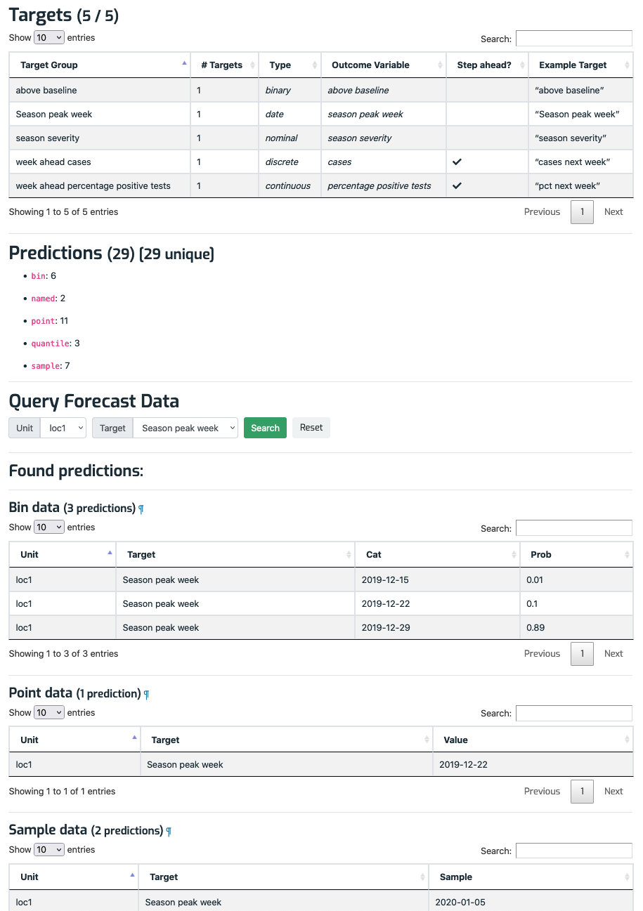

# Forecast detail page

The forecast detail page shows information about a particular forecast, and is divided into five vertical sections with **bold** headings, described next: **Details table**, **Units present**, **Targets present**, **Predictions present**, and **Query form and results**. Here's an example forecast detail page: 

## Forecast details table

At the top of the page is a table showing information related to the forecast:

- _Model_: A link to the owning [model](ModelDetailPage.md).
- _Timezero_: The time zero that the forecast applies to. (The data version date, if any, is not shown here.) See [Concepts](Concepts.md) for more about time zeros.
- _Issued at_: The datetime identifying the forecast's _version_. If there is more than one version for this forecast's timezero then text like "Version 1 of 2" will show. (See [Concepts](Concepts.md) for more about versions.)
- _Data Source_: Text describing where the forecast came from. It can be anything but is typically a data file name, such as a CSV. The source is a link to the forecast's [forecast detail page](ForecastDetailPage.md). It says "(No data)" if a forecast has not yet been uploaded for that time zero. 
- _Upload time_: The date and time that the forecast was uploaded to Zoltar.
- _Notes_: Text describing anything slightly different about a given forecast, e.g., a changed set of assumptions or a comment about when the forecast was created. Notes should be brief, typically less than 50 words.

## Units present

This section is the same as on the [project detail page](ProjectDetailPage.md), but lists only those units for which this forecast predicts.

## Targets present

This section is the same as in [project detail page](ProjectDetailPage.md), but lists only those targets for which this forecast predicts.

## Predictions present

The predictions section has the heading **"Predictions (_)"** (where _ is the actual number of predictions) and a bulleted summary of the counts of the five different prediction types that can be associated with a forecast: `bin`, `named`, `point`, `quantile`, and `sample`. See [Data Model](DataModel.md) for more information on how forecast data is modeled.

## Query form and results

At the bottom of the page under **Query Forecast Data** is a simple form that allows searching the forecast's predictions by unit and target. (Those two dropdown menus contain the units and targets that have predictions, but there's no guarantee that every combination has data.) Clicking Search runs the query and shows the results below the form. There is a table for each type of prediction that's present (`bin`, `named`, etc.) and each table's columns are customized according to the prediction type (all tables have **Unit** and **Target** columns):

- `bin`: **Prob** and **Cat** columns
- `named`: **Family**, **Param 1**, **Param 2**, and **Param 3** columns
- `point`: a **Value** column
- `quantile`: **Quantile** and **Value** columns
- `sample`: a **Sample** column

Here's an example (the page has been scrolled down) under **Found predictions**:

