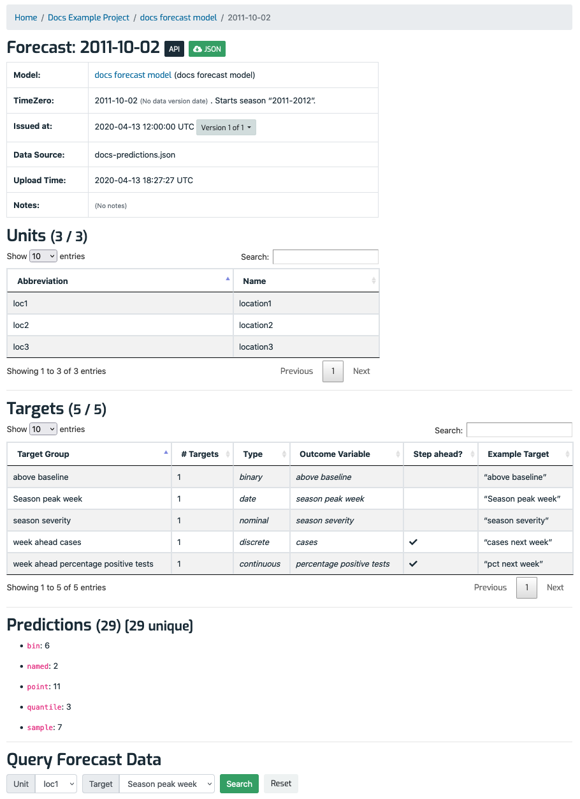

# Forecast detail page

The forecast detail page shows information about a particular forecast, and is divided into two vertical sections with **bold** headings, described next: __Details table__ and __Prediction information__. Here's an example forecast detail page: 

## Forecast details table

At the top of the page is a table showing information related to the forecast:

- _Model_: A link to the owning [model](ModelDetailPage.md).
- _Timezero_: The time zero that the forecast applies to. (The data version date, if any, is not shown here.) See [Concepts](Concepts.md) for more about time zeros.
- _Data Source_: Text describing where the forecast came from. It can be anything but is typically a data file name, such as a CSV. The source is a link to the forecast's [forecast detail page](ForecastDetailPage.md). It says "(No data)" if a forecast has not yet been uploaded for that time zero. 
- _Upload Date_: The date and time that the forecast was uploaded to Zoltar.
- _Notes_: Text describing anything slightly different about a given forecast, e.g., a changed set of assumptions or a comment about when the forecast was created. Notes should be brief, typically less than 50 words.

## Predictions

The predictions section has a heading like **"Forecast has __ predictions"** (where __ is the actual number of predictions) and a bulleted summary of the counts of the five different prediction types that can be associated with a forecast: `bin`, `named`, `point`, `quantile`, and `sample`. The "Download JSON" button downloads a JSON file containing the forecast's predictions. See [Data Model](DataModel.md) for more information on how forecast data is modeled.
