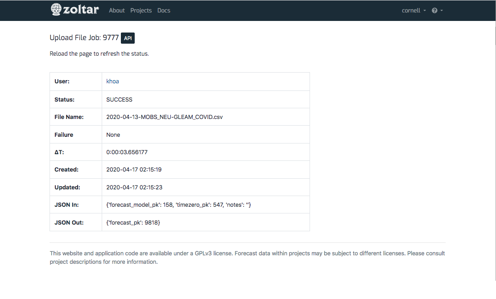
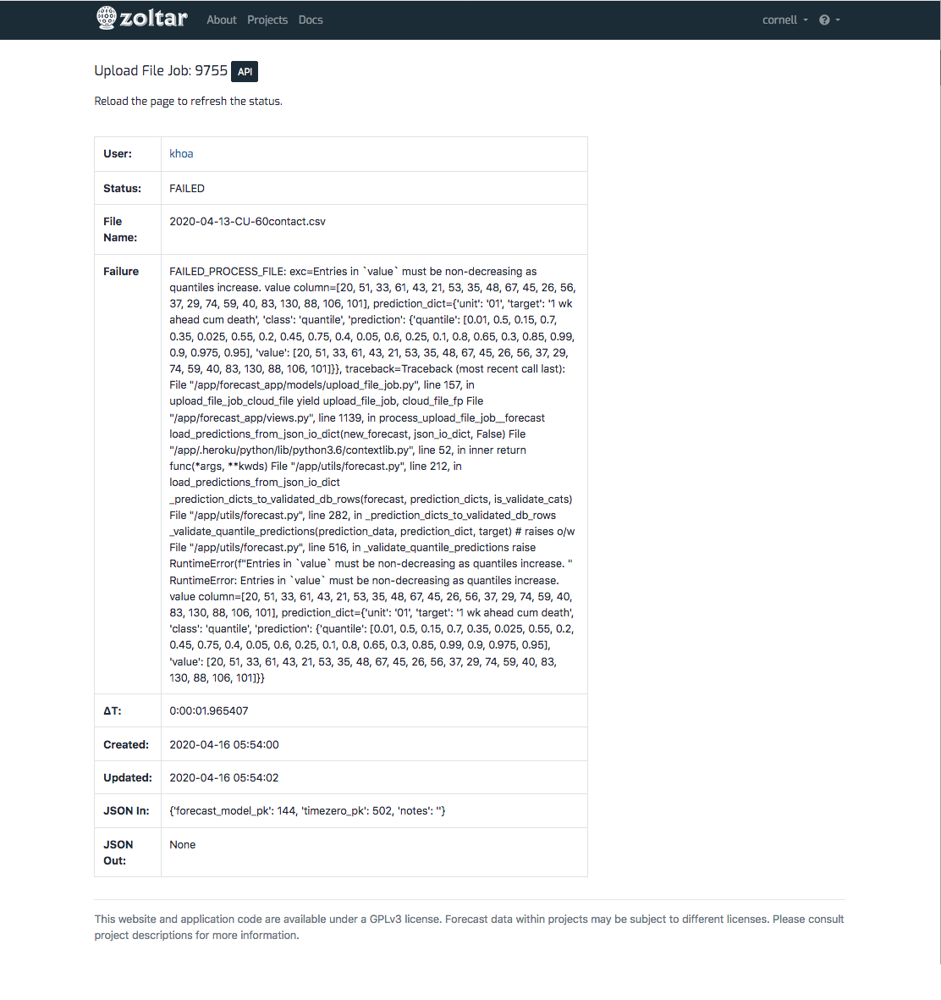

# Managing forecasts

A _forecast_ is a set of predictions for combinations of units and targets. See [Data Model](DataModel.md) for detail on the structure of predictions. Following are the forecast operations you can do from within Zoltar.

> Note: Operations on forecasts, like many Zoltar activities, can be done either through the [zoltardata.com](https://www.zoltardata.com/) web interface or programmatically using the [Zoltar libraries](ApiIntro.md).

## Upload a forecast

Here we show how to upload forecast data into Zoltar. It is important to know that Zoltar _enqueues_ long operations like forecast uploading, which keeps the site responsive but makes uploading a little more complicated. Rather than having the upload feature _block_ until the upload is done, you instead get a quick response in the form of an _upload file job_ detail page that shows the status of your upload. This page is described in [Check an upload's status](#check_an_uploads_status) below.

Forecasts are uploaded to a particular model for a particular time zero. To upload one:

1. Go to the [model detail page](ModelDetailPage.md) of the one you want to upload into.
1. Find the time zero that the forecast is associated with.
1. If the time zero already has a forecast then delete it (see **Delete a forecast** below). You can tell if a time zero has an uploaded forecast in two ways: the text in the "Data Source" column is a link instead of the words "(No data)" and the icon in the "Action" column is a red trash can and not a green upload icon.
1. Click the "Browse..." button in the time zero's "Action" column.
1. In the dialog that appears, select a Forecast data format JSON file
1. Click the green upload button.
1. If the file is OK then you will be taken to an upload file job detail page that shows the status of your upload, with the message "Queued the forecast file __ for uploading.", where __ is your file's name. See [Check an upload's status](#check_an_uploads_status) below for this page's details.
1. Once the upload is successful (you can refresh the upload file job page to check) then you will see it next to the selected time zero on the [model detail page](ModelDetailPage.md).
1. If there was a problem uploading then you will see the upload's status as **FAILED**. The **Failure** section will provide some information to help debug the problem.

## Download a single forecast

> Note: Downloading multiple forecasts is possible, but only programmatically using the [Zoltar libraries](ApiIntro.md). Learn more on the [forecast query format](ForecastQueryFormat.md) page.

To download a particular forecast:

1. Go to the [model detail page](ModelDetailPage.md) where the forecast resides.
1. Click the link in the "Data Source" column to go to the [forecast detail page](Forecasts.md).
1. Click the "Download JSON" button and save the file in the JSON format documented at [Forecast data format](FileFormats.md#forecast-data-file-format-json) for details.

# Delete a forecast

Delete a forecast via these steps:

1. Go to the [model detail page](ModelDetailPage.md) where the forecast resides.
1. Click the red trash can button in the "Action" column.
1. Click "Delete" in the confirmation dialog that appears. **Note that this cannot be undone!**

# Check an upload's status

As described above, uploading a file _enqueues_ the actual uploading of the data for handling by a Zoltar worker process, rather than processing the upload immediately. The upload file job detail page is where you can check the status of an upload. (Note that how long it takes for a file to be processed depends on how busy the site is.) Here's an example upload file job detail page for one whose status is QUEUED:

You can see that it has the following fields:

- _User_: User who uploaded the file.
- _Status_: The upload's status, which is one of the following:
    - **PENDING**: The state an upload starts in.
    - **CLOUD_FILE_UPLOADED**: The uploaded file was successfully saved to temporary cloud storage.
    - **QUEUED**: The upload file job was successfully enqueued for processing.
    - **CLOUD_FILE_DOWNLOADED**: The uploaded file was successfully retrieved from temporary cloud storage
    - **SUCCESS**: The job was successfully completed.
    - **FAILED**: The job failed.
- _File Name_: The uploaded file's name that was given to Zoltar.
- _Failure_: The failure message if status is FAILED, or "None" otherwise. This section will provide some information to help debug the problem.
- _ΔT_: How much time the upload took to process. This is formatted as "<hours>:<minutes>:<seconds>.<microsecond>", For example, "0:00:01.155223" means the job took zero hours, zero minutes, one second, and 155223 microseconds.
- _Created_: Date and time the file was uploaded at.
- _Updated_: The last time the upload's status was changed.
- _JSON In_: The JSON information passed internally to the upload. You can ignore this.
- _JSON Out_: "" returned internally by the upload. ""

Note that you must refresh this page to get the latest status (it does not update dynamically). 

You can see all of your upload file jobs in the **Upload File Jobs** section on your [user profile page](Accounts.md). 

For reference, here are two other jobs in different states. This one's state is SUCCESS:

And this one FAILED:

