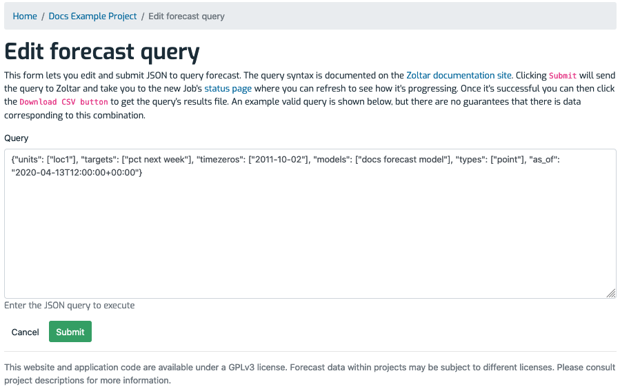

# Managing forecasts

A _forecast_ is a set of predictions for combinations of units and targets. See [Data Model](DataModel.md) for detail on the structure of predictions. Following are the forecast operations you can do from within Zoltar.

> Note: Operations on forecasts, like many Zoltar activities, can be done either through the [zoltardata.com](https://www.zoltardata.com/) web interface or programmatically using the [Zoltar libraries](ApiIntro.md).
>
> Note: As mentioned in [Concepts](Concepts.md), forecasts can have versions via their `issue_date` field. However, versioning is currently supported only via the API.

## Upload a forecast

Here we show how to upload forecast data into Zoltar.

> Note: As mentioned at [Jobs](Jobs.md), uploading a forecast is done in a separate worker process because it may take more than a handful of seconds to run. Thus the workflow is based on that (see [Job workflow](Jobs.md#workflow) for details).

Forecasts are uploaded to a particular model for a particular time zero. To upload one:

1. Go to the [model detail page](ModelDetailPage.md) of the one you want to upload into.
1. Make sure "Hide if no data" is unchecked.
1. Find the time zero that the forecast is associated with.
1. If the time zero already has a forecast then delete it (see **Delete a forecast** below). You can tell if a time zero has an uploaded forecast in two ways: the text in the "Data Source" column is a link instead of the words "(No data)" and the icon in the "Action" column is a red trash can and not a green upload icon.
1. Click the "Browse..." button in the time zero's "Action" column.
1. In the dialog that appears, select a Forecast data format JSON file
1. Click the green upload button.
1. If the file is OK then you will be taken to a [job detail page](Jobs.md#check-a-jobs-status) that shows the status of your upload, with the message "Queued the forecast file _ for uploading.", where _ is your file's name.
1. Once the upload is successful (you can refresh the job detail page to check) then you will see the newly-uploaded file listed next to the selected time zero on the [model detail page](ModelDetailPage.md).
1. If there was a problem uploading then you will see the upload's status as **FAILED**. The **Failure** section will provide some information to help debug the problem.

## Delete a forecast

Delete a forecast via these steps:

1. Go to the [model detail page](ModelDetailPage.md) where the forecast resides.
1. Click the red trash can button in the "Action" column.
1. Click "Delete" in the confirmation dialog that appears. **Note that this cannot be undone!**

## Download a single forecast

To download a particular forecast:

1. Go to the [model detail page](ModelDetailPage.md) where the forecast resides.
1. Click the link in the "Data Source" column to go to the [forecast detail page](ForecastDetailPage.md).
1. Click the "Download JSON" button and save the file in the JSON format documented at [Forecast data format](FileFormats.md#forecast-data-file-format-json) for details.

(Note that if you are only interested in a particular unit/target combination, you can use the "Query Forecast Data" form on that page - see [here](ForecastDetailPage.md#query-form-and-results) for details.)

## Download multiple forecasts

> Note: Downloading multiple forecasts is currently available only to users with Zoltar accounts.
>
> Note: As mentioned at [Jobs](Jobs.md), downloading a forecast is done in a separate worker process because it may take more than a handful of seconds to run. Thus the workflow is based on that (see [Job workflow](Jobs.md#workflow) for details).

Forecasts are downloaded by executing a [forecast query](ForecastQueryFormat.md) by either a) [Zoltar API](Api.md) using the [Zoltar libraries](ApiIntro.md), or b) via a simple web UI form (shown below). In both cases you need to follow these steps:
 
 1. Decide the data of interest (i.e., `models`, `units`, `targets`, `timezeros`, and prediction `types`).
 1. Submit the query to get a Job ID.
 1. Poll the resulting Job until it succeeds (see [Check a job's status](Jobs.md#check-a-jobs-status)).
 1. Download the job's data (see [Download a job's data](Jobs.md#download-a-jobs-data)). The format is described at [Forecast data format (CSV)](FileFormats.md#forecast-data-format-csv).
 
 
## Download multiple forecasts via the web UI
 
 To download forecast data via the web UI:
 
 1. Go to the [project detail page](ProjectDetailPage.md) whose models contain the forecasts. 
 1. Click the "Download" button to the right of "Forecasts" in the Features section at the page's top.
 1. On the "Edit Forecast Query" page that shows, enter your query and then click "Submit" (see the screen shot below).
 1. Poll the resulting Job until it succeeds (see [Check a job's status](Jobs.md#check-a-jobs-status)).
 1. Download the job's data (see [Download a job's data](Jobs.md#download-a-jobs-data)).

Here's an example of the Edit Forecast Query page:

