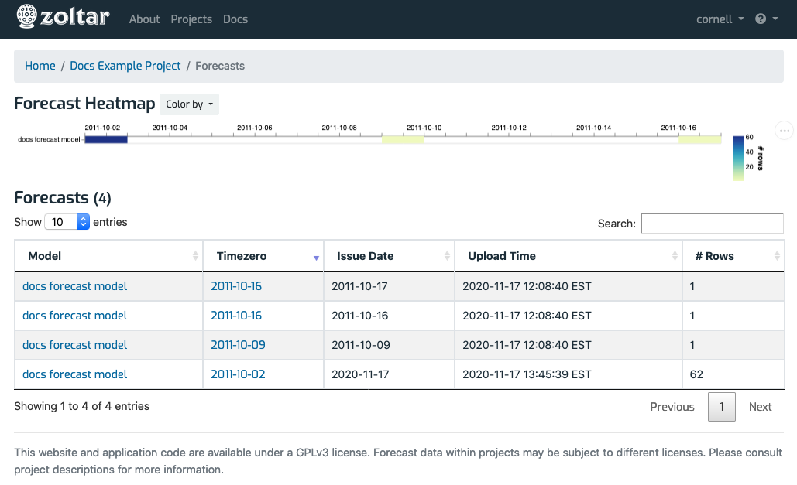
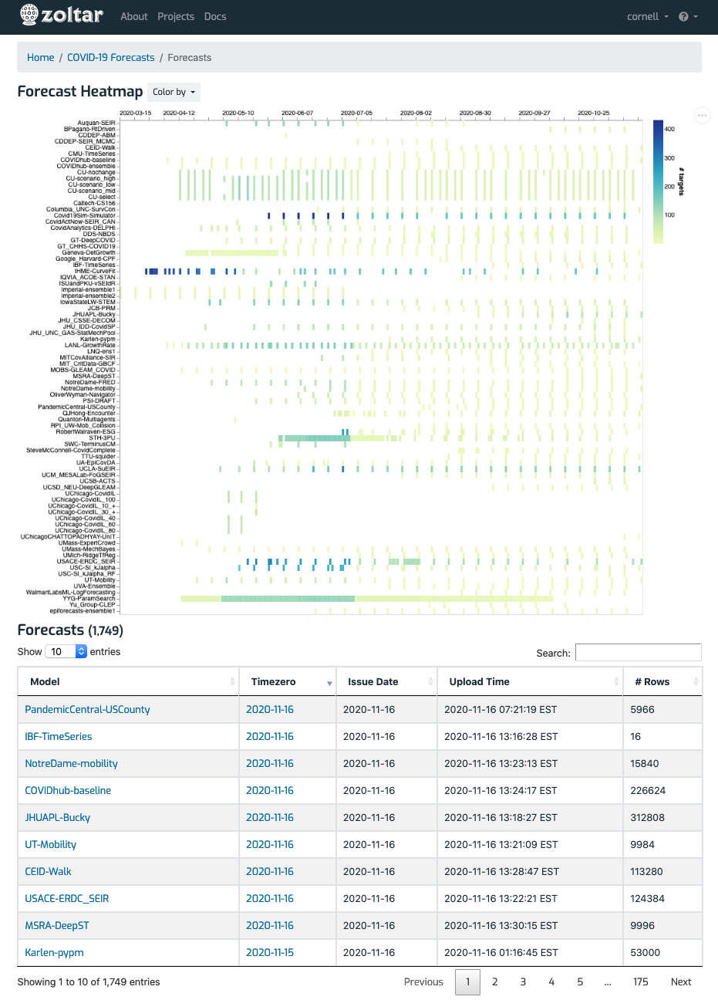

# Forecasts summary page

Reached via the [project detail page](ProjectDetailPage.md)'s _Features_ section, this page collects a summary of all of a project's forecasts. It contains a heatmap at the top that can be colored in one of three ways (# predictions, # units, or # targets), and a table of all forecasts (including all versions) in the project. Follow are examples from two projects. Hovering the mouse over the heatmap shows information for that particular forecast (only the latest versions are shown), and clicking takes you to that forecast.

## Documentation project

## Covidhub project

