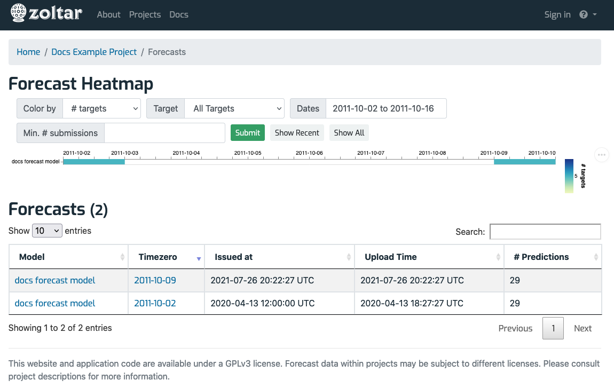
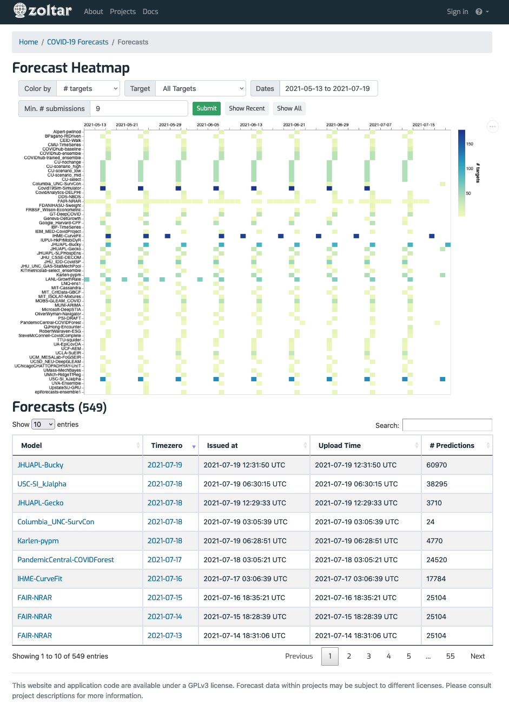

# Forecasts summary page

Reached via the [project detail page](ProjectDetailPage.md)'s _Features_ section, this page collects a summary of all of a project's forecasts. It has a heatmap at the top that can be colored in one of three ways (# predictions, # units, or # targets), and a table of all forecasts (including all versions) in the project. Note that the table's contents have the same filtering applied as the heatmap. 

You can filter the display and the results via the form at the top:

- **Color by**: A dropdown of three choices, controls which aspect of forecasts is to be shown: _# predictions_, _# units_, or _# targets_ (the default). 
- **Target**: A dropdown of project's target groups, allows filtering by target. The default is no target filtering. 
- **Dates**: Opens a date range picker to choose the start and end dates of forecast time zeros that should be included in the display. Defaults to the project's 60 most recent time zeros. You will see the default filled in on the form if it was applied.
- **Min. # submissions**: An integer that filters based on how many forecasts a model has made. Only models with at least that many forecasts will be shown. The default is to show only those models' forecasts that are at least 5% of the max number of submissions from any model. You will see the default filled in on the form if it was applied.

There are three buttons in the filter section:

- **Submit**: Applies the form's contents and displays the resulting forecasts.
- **Show Recent**: Shows the forecasts matching the default filtering above. This is the equivalent of going straight to this page from the [project detail page](ProjectDetailPage.md).
- **Show all**: Overrides all filtering to show all of the project's forecasts. Note that this may be slow to load for large projects.

Following are examples from two projects. Hovering the mouse over the heatmap shows information for that particular forecast (only the latest versions are shown), and clicking takes you to that forecast.

## Documentation project

## Covidhub project

