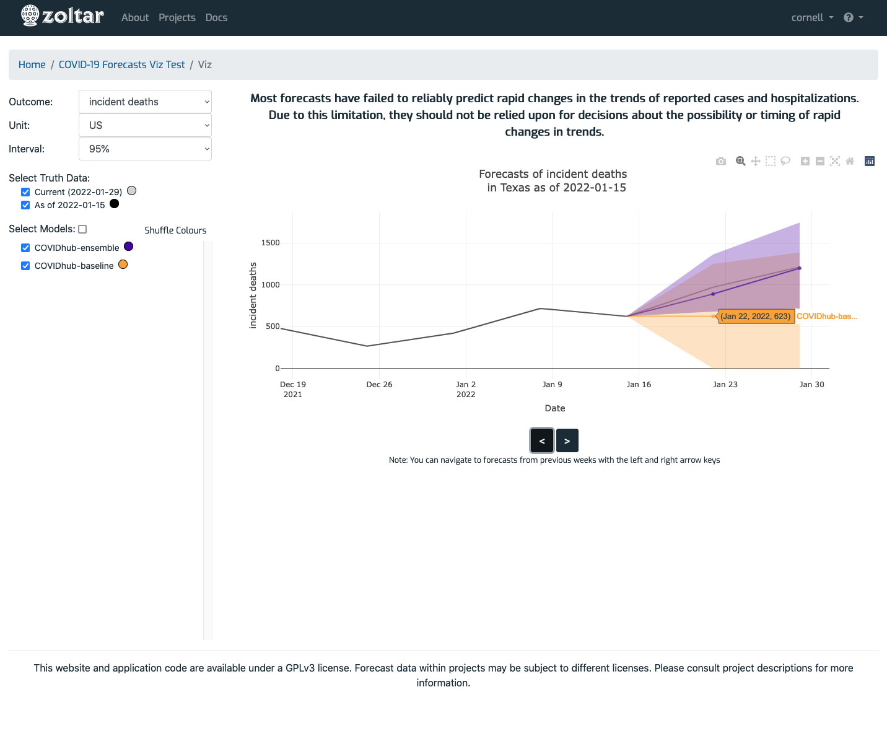

# Forecasts visualization page

> Note: Currently the visualization feature is only available to logged in users. Please see the [contact section](index.md#contact) on the index page for account requests.

Reached via the [project detail page](ProjectDetailPage.md)'s _Features_ section, this page lets you explore forecast data in line chart form. The page has these sections (refer to the screenshot below):

- **Forecast selection**: Located on the left side, this section controls which data is shown.
- **Plot area**: Located on the right, this is where the plot is displayed. It shows data for the currently-selected date (indicated in the text above the plot starting "Forecasts of ...") which is changed by using the left and right arrow buttons, or the left and right arrow keyboard keys. Hovering the mouse over the data points shows details for model, date, and value. You can customize the plot by using the gray icons that appear in the plot's upper right corner (camera, magnifying glass, etc.) when the mouse is above the plot.

About performance: The visualization feature is currently in beta, and performance is sometimes slow for certain operations. In particular, the ones that retrieve data from Zoltar (i.e., changing Outcome or Unit, or using the arrows) can be delayed depending on the project. 

> Note: The plot area is grayed out while data is being retrieved.

## Example page

