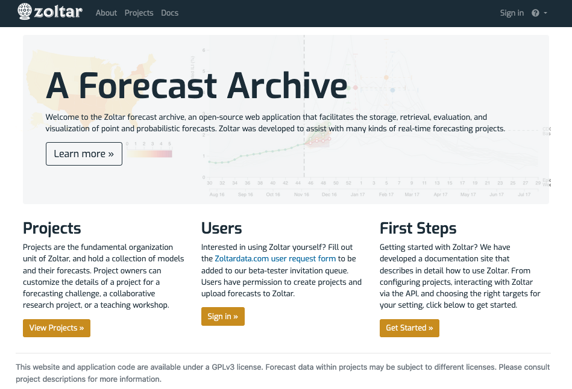

# Zoltar Home page

The Zoltar home page [zoltardata.com](https://www.zoltardata.com/) is a simple welcome page with options for listing all projects, signing in, or getting started reading this documentation. Clicking on "View Projects" below the "Projects" text (or "Projects" in the header) takes you to the [Zoltar Projects page](https://www.zoltardata.com/projects), which lists all of the projects in the archive.

## Navigation header

At the page's top is a black navigation header that's shown on all pages. It contains three icons: Home page (the Zoltar crystal ball in the upper left), and on the right a user dropdown menu and a help icon (question mark) on the far right. The dropdown menu's appearance depends on whether a user is logged in. If you are not logged in then "Sign in" is shown as in the screenshot. Clicking "Sign in" takes you to a typical login page where you specify your account's user name and password. (To obtain an account, please [contact us](index.md#contact).) If you are logged in then its text is the user name and the menu items are links to the user profile page, and a logout item. Currently, the page looks like this:

## Projects page

A *project* is a collection of *forecast models* and their *forecasts*, and is described in more detail below. The projects page shows basic project information, including name, owner, description, and (in the "Summary" column) information about the number of models, forecasts, and predictions in the project. (See [Data Model](DataModel.md) for more information on terminology like _predictions_.) Currently, the page looks like this:

This page shows all projects in the archive that are visible to you, based on whether you are logged in and which projects you account has access to. Thus, some may be hidden. Above the list is some information about this (_There are 6 public projects and 1 project with access limited to collaborators only._)

From here you can:

- Click on a project name to go to its [detail page](ProjectDetailPage.md).
- Create a project if you are signed in. (Any logged in user can create projects via the "New" dropdown button towards the top. Clicking it allows you to create one either by uploading a [project configuration file](FileFormats.md#project-creation-configuration-json) or creating via a form where you can fill in some basic details. See [Creating projects](Projects.md) for details.
