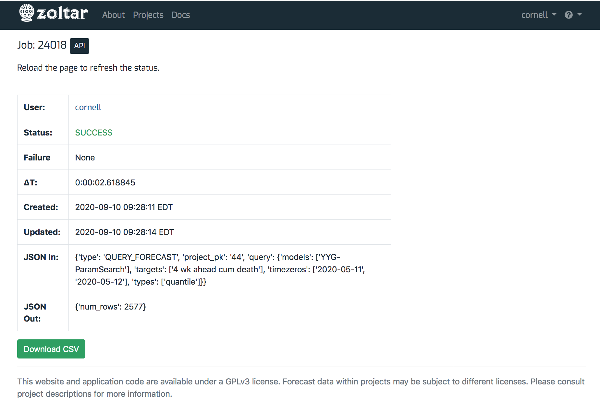
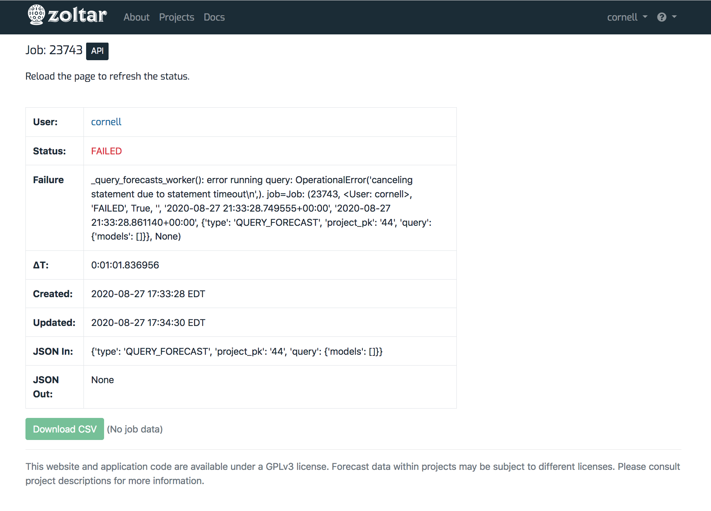
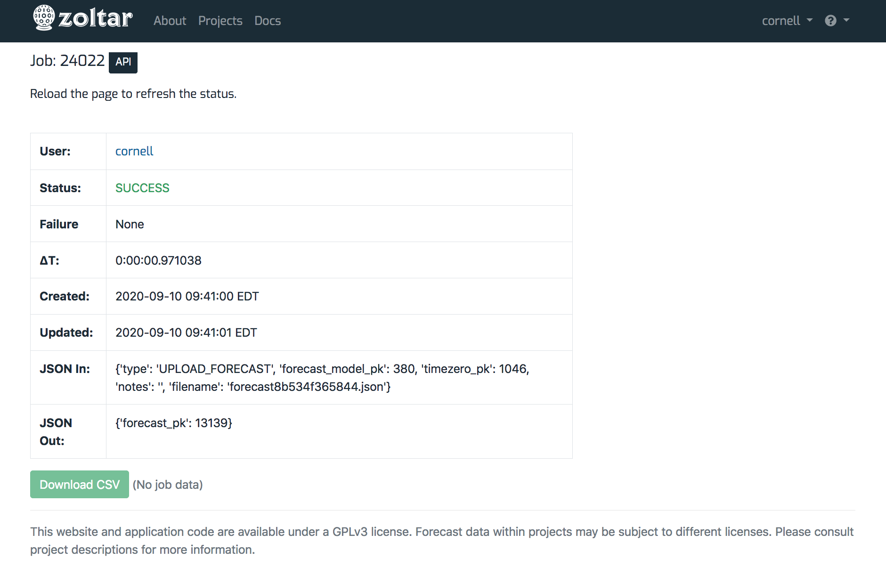

# Jobs

Some Zoltar operations can take longer than a handful of seconds to run. For these cases, Zoltar offloads them to a separate worker process so that the web site remains responsive. We call those offloaded operations **Jobs**, and this page describes how to work with them.

These are the activities that return jobs:

- Uploading truth, uploading a forecast (does not result in data)
- Deleting a forecast (no data)

To see a list of all of your jobs, go to your [profile page](Accounts.md#view-your-profile-page) and scroll down to the **Jobs** section.

## Workflow

When you initiate one of the above activities (either via the Web or the API), Zoltar creates an internal Job to track it and returns that Job's ID so you can check its status and optionally download any corresponding data. The workflow is:

1. Initiate the activity. This returns a job that you can use to a) track the status of the query, and b) optionally download the job's data.
1. Poll the job until its status is **SUCCESS**. (You can use the web UI to do this - see [Check a job's status](#check-a-jobs-status) for how.)
1. Optionally [download the job's data](#download-a-jobs-data), if applicable. Note that data is available for 24 hours after it's created.

## Check a job's status

The job detail page is where you can check the status of long-running activities. (Note that how long it takes for a file to be processed depends on how busy the site is.) Note that you must refresh this page to get the latest status (it does not update dynamically).

Here's an example job detail page for an upload whose status is SUCCESS:

You can see that it has the following fields:

- _User_: User who uploaded the file.
- _Status_: The upload's status, which is one of the following:
    - **PENDING**: The state an upload starts in.
    - **CLOUD_FILE_UPLOADED**: The uploaded file was successfully saved to temporary cloud storage.
    - **QUEUED**: The upload file job was successfully enqueued for processing.
    - **CLOUD_FILE_DOWNLOADED**: The uploaded file was successfully retrieved from temporary cloud storage
    - **SUCCESS**: The job was successfully completed.
    - **FAILED**: The job failed.
    - **TIMEOUT**: The job ran too long and was terminated.
- _Failure_: The failure message if status is FAILED, or "None" otherwise. This section will provide some information to help debug the problem.
- _ΔT_: How much time the upload took to process. This is formatted as "<hours>:<minutes>:<seconds>.<microsecond>", For example, "0:00:01.155223" means the job took zero hours, zero minutes, one second, and 155223 microseconds.
- _Created_: Date and time the file was uploaded at.
- _Updated_: The last time the upload's status was changed.
- _JSON In_: The JSON information passed internally to the upload. You can ignore this.
- _JSON Out_: "" returned internally by the upload. ""

Here is a job whose status is FAILED, with a failure message:

## Download a job's data

Each job's detail page has a "Download CSV" button at the bottom. The button is enabled if the job has corresponding data, and disabled otherwise with the message _(No job data)_ next to the button.

The first screenshot above shows a job that has data that can be downloaded. Here's a job with no data available:

