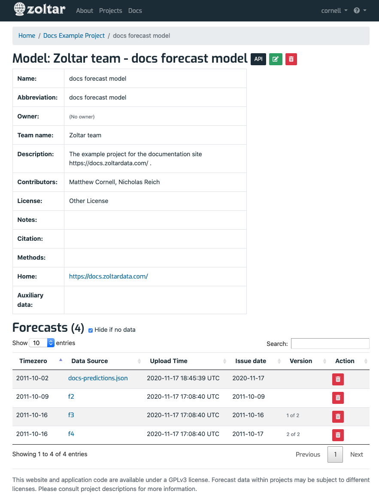

# Model detail page

A **model** is the representation of code that generates forecasts. Clicking on a model link takes you to its detail page. The detail page is divided into two vertical sections with **bold** headings, described next: **Details table** and **Forecasts**. Here's an example model detail page:

## Model details table

At the top of the page is a table showing information related to the model:

- _Name_: The model's name.
- _Abbreviation_: A short name for the model. It's the primary way that models are named.
- _Owner_: The model's owner. The owner is the user that created the model (which is done on the home page), and she can edit or delete the model, and upload or delete its forecasts.
- _Project_: A link to the project the model belongs to.
- _Team name_: The name of the team that developed the model. This is not used directly by Zoltar.
- _Description_: Prose provided by model owner. It should include information on reproducing the model's results.
- _Contributors_: List of names as specified by the model owner.
- _License_: License ""
- _Notes_: ""
- _Citation_: ""
- _Methods_: ""
- _Home_: A link to the model home page.
- _Auxiliary data_: An optional link to model-specific data files that were used by the model beyond the project's core data. Not used directly by Zoltar.

## Forecasts

The **Forecasts** section is a table of the model's forecasts, ordered by project's time zeros. Each row has these fields:

- _Timezero_: The time zero that the forecast applies to. (The data version date, if any, is not shown here.) See [Concepts](Concepts.md) for more about time zeros.
- _Data Source_: Text describing where the forecast came from. It can be anything but is typically a data file name, such as a CSV. The source is a link to the forecast's [forecast detail page](ForecastDetailPage.md). It says "(No data)" if a forecast has not yet been uploaded for that time zero. 
- _Upload Time_: The date and time that the forecast was uploaded to Zoltar.
- _Issue date_: The date identifying the forecast's _version_. If there is more than one version for this forecast's timezero then text like "Version 1 of 2" will show in the Version column. (See [Concepts](Concepts.md) for more about versions.)
- _Version_: Text describing the version, such as "Version 1 of 2". It is empty if there's only one forecast version for the timezero.
- _Action_: A button that is either a green upload icon if there is no data associated with the time zero, or a red delete button otherwise. See [Forecasts](Forecasts.md) for instructions on how to upload forecasts, and [File formats](FileFormats.md#forecast-data-format-json) for how forecast files are structured in Zoltar. This feature is enabled only for project owners or model owners.

The **Hide if no data** checkbox, if checked, shows only those Timezeros that have an uploaded forecast. Uncheck it to see all Timezeros (necessary if you want to upload any). 