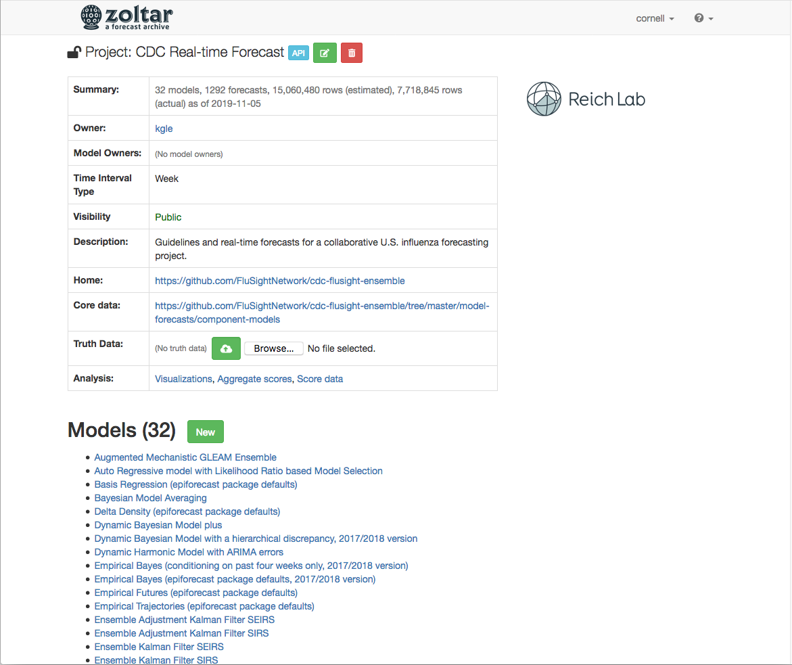
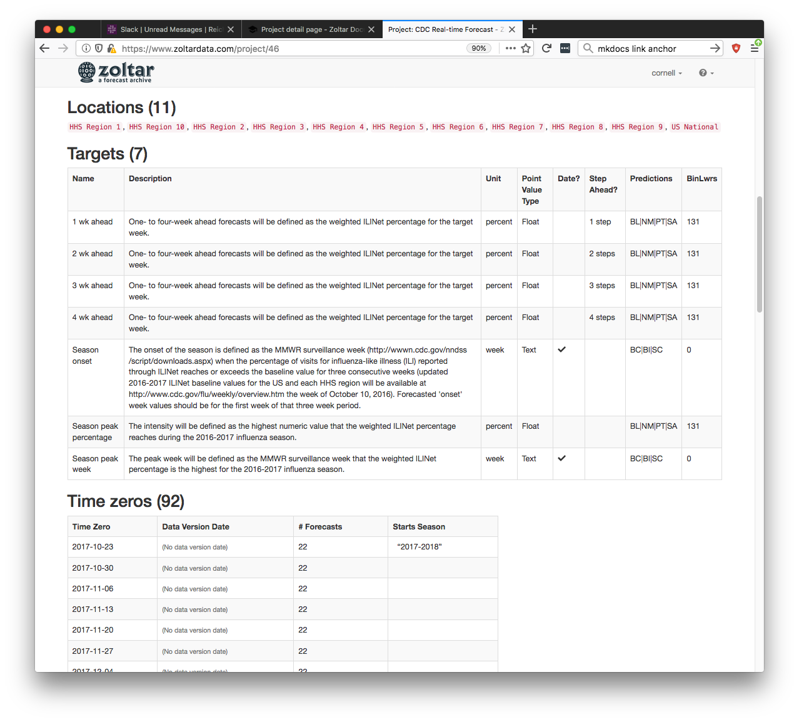

# Project detail page

A *project* is the main element for representing a forecasting challenge. It has an *owner* (a registered user in the
system), and zero or more *model owners* (also users). A project owner can do anything to the project, including what
model owners can do, but model owners are limited to creating, editing, and deleting Models, and uploading and deleting
forecasts. (To become a model owner you must contact the project owner.)

Each project's detail page is divided into four vertical sections, described next: Details table, forecast models,
targets, and time zeros. Currently the top looks something like this. (The project shown is a large one, so only the
details table and Models sections are visible.)

## Project details table

At the top of the page is a table showing non-model information related to the project:

- *Summary*: The same summary as on the home page: An estimate of the number of models and forecasts in the project.
- *Owner*: The user that has full control of the project, and includes authorization to view, edit, and delete anything
  (models, forecasts, etc.) The owner is the user that created the project (which is done on the home page).
- *Model owners*: A list of users who can view the project (applicable only if the project is private), and who can
  create and delete models, and upload and delete forecasts. The project owner controls specifies model owners when she
  creates or edits the project.
- *Time Interval Type*: Tells the [D3 Foresight](https://github.com/reichlab/d3-foresight) component what its x-axis
  label should be. Choices: Week, Biweek, or Month.
- *Visibility*: A project can be either public or private, which controls project visibility, including accessing data.
  This applies to list and detail pages, along with API endpoints. Public projects are available to anybody, users and
  anonymous visitors included. Private projects can only be viewed by project owners and model owners. This means that in
  order to grant a user access to a private account, the project owner must add her to the project's model owners list,
  even if that user will not be managing any models.
- *Description*: Prose provided by project owner. It should cover the following topics:
    - Information about the "real-time-ness" of data, i.e., revised/unrevised.
    - Details about how models interpret time zeros and data version dates.
    - Data file naming scheme.
- *Home*: A link to the project's home page, which might include details about any competitions, source code, team
  members, included models, etc.
- *Core data*: A link to a page that contains data (e.g., CSV files) used to train models. For model competitions, it
  should include all data sets made available to everyone in the challenge, including supplemental data like Google
  queries or weather data. Ideally Zoltar users interested in re-running a project's models have all they need in the home
  and core data directories. However, they are not used directly by Zoltar.
- *Truth data*: Similar to the template, this is a data file that the project owner uploads. This data contains observed
  target values for time zeros and locations in the project, and is a project-agnostic way to capture actual values that
  models predicted for. It is used to calculate scores, and to extract the 'actual' data used in the D3 component's
  TimeChart. Each Project is responsible for generating a truth table csv file in a project-specific manner. Details:
    - CSV file
    - No file name restrictions
    - Columns: `Timezero`, `Location`, `Target`, `Value` - see FileFormats.md .
- *Analysis*: Links to visualization and score pages (see below for details).

## Forecast models

The **Models** section lists the project's forecast models by name, with links to model detail pages (see details
below). If you're a project owner or model owner then a "New" button is shown that takes you to a form for creating a
model.

## Locations

This section lists names of the locations in the project. These were either defined by project owner when creating the
project, or were created automatically when the project template was loaded and a referenced location was not found.
Here's a screen shot that shows Locations for a particular project, along with the Targets and TimeZeros sections that
are described next: 

## Targets

This section lists information about project forecast targets. Like locations, these were either created explicitly by
the project owner, or automatically when the template was loaded. The information includes the following fields.

- *Name*: Self-explanatory.
- *Description*: "".
- *Unit*: E.g., "percent" or "week". Unit is used when previewing data, and when downloading it.
- *Point Value Type*: todo
- *Date?*: This identifies whether the target is date-related or not. Examples of date-related targets might include
  "Season onset" or "Season peak week".
- *Step Ahead?*: Shows two pieces of information: 1) Whether the target is a "step ahead" one, and (if so) 2) what the
  "step ahead increment" is. (Step ahead targets are used to predict values in the future, and are used by some analysis
  tools.)
- *Predictions*: todo
- *BinLwrs*: todo

## Time zeros

This section details the project's `time zeros`. About time zeros and `data version dates`: Because the forecasting
field does not have standard terminology, we have settled on the following two concepts for this application. Note that
some time zeros are tagged as starting a season, specifying the season's name, which helps to segment the time zeros.
Zoltar uses season information in the visualization and score pages, where the user can select which season to show data
for. This also helps to keep performance up.

- *Time zero*: The date from which a forecast originates and to which targets are relative (i.e. a "2-week-ahead
  forecast" is two weeks ahead of the time-zero). Every forecast has a time zero.
- *Data version date*: An optional additional piece of metadata for a forecast. If it exists, it is associated with a
  time-zero. It refers to the latest date at which any data source used for the forecasts should be considered. If
  present, it can be used externally by system users to recreate model results by "rolling back" the core data to a
  particular state.
- *# Forecasts*: A count of the number of forecasts for this time-zero.
- *Starts Season*: Shows two pieces of information: 1) Whether the time zero is starts a season (it is blank if it does
  not start a season), and 2) the season name itself (which indicates the time zero does start a season.)

