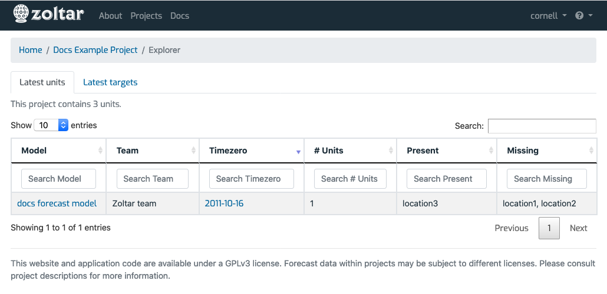
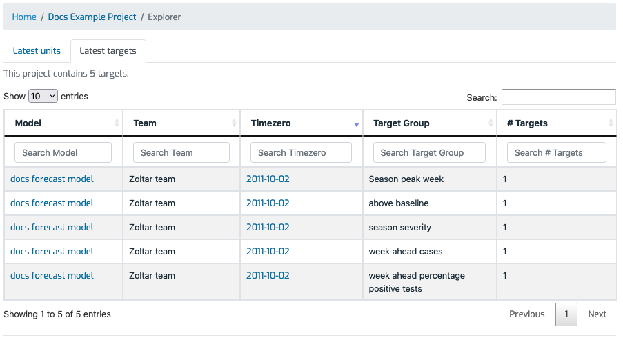

# Project explorer page

Reached via the [project detail page](ProjectDetailPage.md)'s _Features_ section, this page has two tabs that show unit and target summaries for each model in the project, respectively, along with a link to the model's latest forecast.

## Latest units tab

## Latest targets tab

