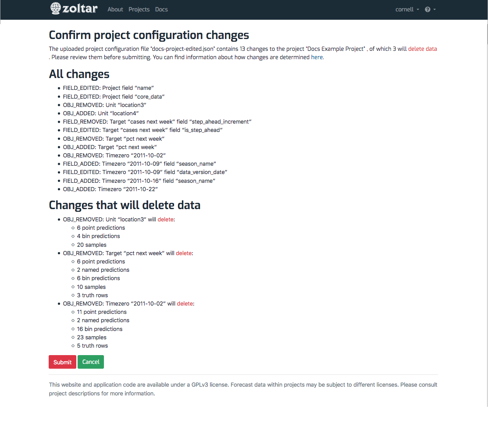

# Manging Projects

_Projects_ are the central organizing concept in Zoltar. They define the _units_, _targets_ and _time zeros_ that forecasts are relative to, and contain the _forecast models_ that teams use to represent a forecasting challenge. Described here are the common operations done with projects. Note that you must have a Zoltar account to create a project, and only project owners can edit or delete projects. (Fill out the [Zoltardata.com user request form](https://docs.google.com/forms/d/1C7IEFbBEJ1JibG-svM5XbnnKkgwvH0770LYILDjBxUc/viewform?edit_requested=true) to be added to our beta-tester invitation queue.)

## Create a project

There are two ways to create a project: by editing a form or by uploading a JSON project configuration file. Using a form is a quick way to make a project to get a team started, but is very limited in what can be specified, mainly the information in the **Details table** as described in the link above (name, visibility, time interval type, description, home URL, core data, logo url, and model owners). The second method - using a configuration file - is preferred as it allows specifying all aspects of a project. Both methods are accessed via the green "New" dropdown button at the top of the [Projects page](HomePage.md#projects-page).

### To create a project via a form:

1. Click the green "New" button at the top of the projects list and select "From form..."
1. Fill in the fields and click "Create". Most fields are required, which will be indicated with error messages when you submit the form and any are missing. 

### To create a project via a configuration file:

1. Click the green "New" dropdown button at the top of the projects list and select "From file..."
1. In the dialog that appears, click the "Browse..." button to select a project configuration JSON file.
1. Click the green upload button.

Depending on the file you uploaded you will see either a message noting success ("Created project __" message at the top of the page) or an error page with a message showing the details.

It may be helpful to get started by downloading and modifying an existing project's configuration file:

1. Go to the project of interest's [detail page](ProjectDetailPage.md).
1. At the top, to the right of the project name, click the green download "Config" button and save the file.

Note that the `id` and `url` fields in the downloaded file are ignored when creating a new project from that file, and can safely be edited out when creating your new file.

## Edit a project

There are two ways to edit a project, similar to creating one as described above: by editing a form or by uploading an edited version of the original JSON project configuration file that was used to create the project. Both are accessed from the project's [detail page](ProjectDetailPage.md) using the green "Edit" dropdown button to the right of the project name.

### To edit a project via a form:

1. Click the green "Edit" dropdown button at the top of the projects list and select "From form..."
1. Edit the fields as above and then click "Save".

### To edit a project via a configuration file:

1. Click the green "Edit" dropdown button at the top of the projects list and select "From file..."
1. In the dialog that appears, click the "Browse..." button to select a project configuration JSON file.
1. Click the green edit button.

This invokes a kind of ["diff" analysis](https://en.wikipedia.org/wiki/File_comparison) that compares the uploaded file to the to-be-edited project's current structure. The result is shown on a "Confirm project configuration changes" page listing the changes you're about to apply. (You will see an error page if there's a problem with the uploaded file.) The confirmation page has three possible sections:

- A sentence at the top summarizing the changes, including whether any will delete data.
- **All changes**: All changes that were detected, including both non-data-destructive and destructive ones.
- **Changes that will delete data**: Lists just the data-destructive changes, including details about what kinds of predictions (or truth) will be deleted, and how many of each.

Here's an example:

The diff function categorizes each change according to the type of change and what item it applies to. For example, the first change under **All changes** in the above screen shot is the editing of the project's "name" field. Another change is the third one in that list, which is the removal of the _unit_ abbreviated "loc3". Here are all the kinds of change that might be identified:

- _OBJ_ADDED_: An item of a particular type will be added to the project. For example, adding a new unit abbreviated "loc4".
- _OBJ_REMOVED_: "" will be removed "" from a project. Removing the target "pct next week", say. 
- _FIELD_EDITED_: An item's field will be set to a new value. For example, setting the "data_version_date" of the project's time zero named "2011-10-09".
- _FIELD_ADDED_: Set an item's field that was not set before. Adding a "season_name" to the time zero "2011-10-16", say.
- _FIELD_REMOVED_: Remove an item's field, such as the "numeric_horizon" of the target "cases next week"." 

As implied above, there are four types of item that can be changed: The _project_ itself or one of its _units_, _targets_, or _time zeros_.

## Delete a project

Finally, to delete a project:

1. Go to the project of interest's [detail page](ProjectDetailPage.md).
1. At the top, to the right of the project name, click the red delete trash can button and then click "Delete" in the confirmation dialog that appears. **Note that this cannot be undone!**
