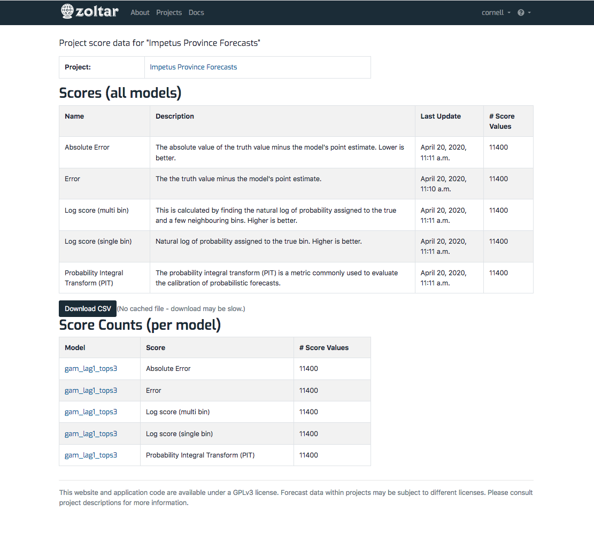

# Scoring in Zoltar

Zoltar automatically computes a fixed set of scores (more are in development) for all projects and forecasts. They are updated in the background on a per-forecast basis by a scheduler that currently runs Daily at [5:30 AM UTC](http://www.timebie.com/std/utc.php?q=5.5). The update is performed only on models that have changed, i.e., those that have added or removed forecasts since the last update. Following are details about scoring.

# Scoring requirements

For Zoltar to calculate a forecast's scores, the following must be true:

- [Ground truth](Truth.md) has been uploaded, and contains truth values for each unit/target combination in the forecast.
- Data is available in the prediction elements shown in the table [Available scores by target type and prediction element](Targets.md#available-scores-by-target-type-and-prediction-element).
<!-- todo more requirements? -->

## Current scores

At the time of writing Zoltar implements these scores:

- **Error**: The the truth value minus the model's point estimate. 
- **Absolute Error**: The absolute value of the truth value minus the model's point estimate. Lower is better.
- **Log score (single bin)**: Natural log of probability assigned to the true bin. Higher is " "better." More detail is [here](https://github.com/reichlab/flusight/wiki/Scoring#2-log-score-single-bin).
- **Log score (multi bin)**: This is calculated by finding the natural log of probability " "assigned to the true and a few neighbouring bins. Higher is better. See [this page](https://github.com/reichlab/flusight/wiki/Scoring#3-log-score-multi-bin) for how it works.
- **Probability Integral Transform (PIT)**: The probability integral transform (PIT) is a metric commonly " "used to evaluate the calibration of probabilistic forecasts. 
- **Interval**: This score is a proper score used to assess calibration and sharpness of quantile forecasts. Lower is better. The supported intervals alpha values are: 0.02, 0.05, 0.1, 0.2, 0.3, 0.4, 0.5, 0.6, 0.7, 0.8, 0.9, and 1.0. 

In addition, aggregate score values are calculated (see below).

## Viewing scores

Scores are accessed from the [project detail page](ProjectDetailPage.md) of the project of interest via the links in the **Analysis** row in the project details table at the top of the page. There are three links:

- _Visualizations_: Takes you to a page that shows a time chart of the project's predictions. See the [visualization](Visualization.md) page for details.
- _Aggregate scores_: Goes to the "Mean Absolute Error" page. [Absolute error](https://github.com/reichlab/flusight/wiki/Scoring#1-absolute-error) is the absolute value of difference between the eventually observed value and the point prediction. This page is an aggregate of scores that are currently in Zoltar, and only as up-to-date as they are. No scores are shown for a particular unit or target if the errors could not be calculated because not all truth values were available for it. <!-- TODO more detail -->
- _Score data_: The linked-to page shows score counts at both the project and model levels. Only those scores that have values are shown.

Here's an example score page: 

## Downloading scores

Currently scores can only be downloaded programmatically using the [Zoltar libraries](ApiIntro.md). Learn more on the [score query format](ScoreQueryFormat.md) page.
