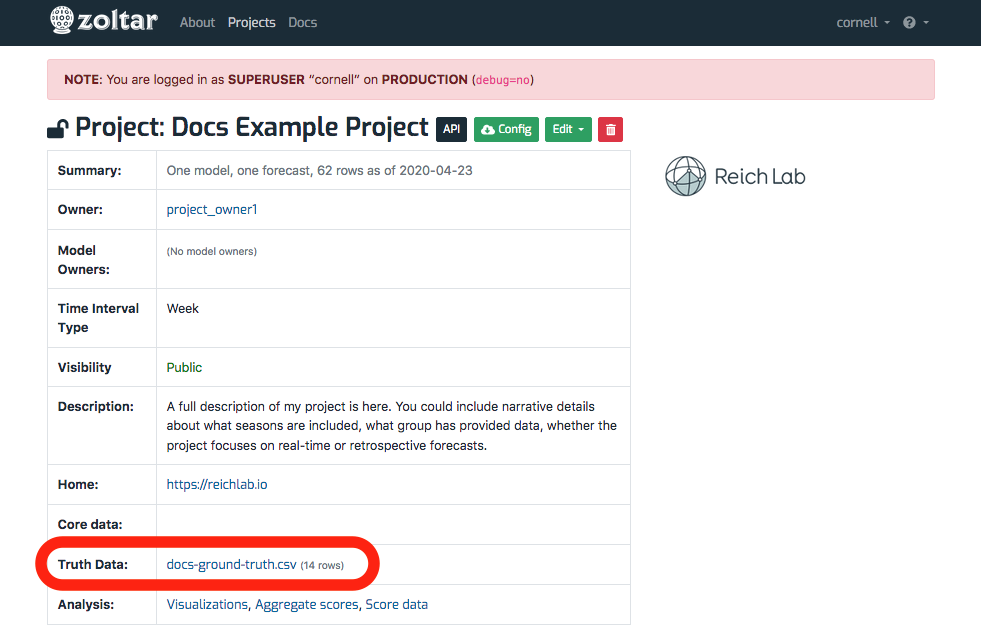
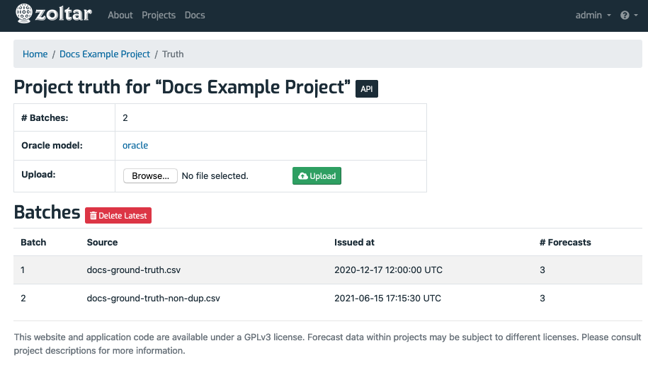

# Ground truth

## How truth is represented in Zoltar 
Zoltar supports storing ground truth data for each project that desires to do scoring. Before describing details below about managing truth, we need to lay out how Zoltar stores truth and how it supports truth versioning.

When a truth file is loaded (see file format information below), Zoltar groups the input rows (point predictions) by timezero and then loads all predictions for each timezero into one forecast in an internally-managed "oracle" model. This results in a group of forecasts that stemmed from the same truth file, and we call this group a "batch". The loader sets all the oracle forecasts for a particular batch to have the same `source` and `issued_at` fields, and that 2-tuple is how we identify batches.

(Unlike user-created models, the oracle model is not directly worked with; it's all handled through truth-specific functionality, but you will see oracle and batch information in the user interface.)

Because truth is stored as Zoltar forecasts, truth versioning is supported: each uploaded batch represents a version.

## Manging truth data

Truth data is specified as a CSV file as documented in [Truth data format](FileFormats.md#truth-data-format-csv), and each project is responsible for generating the CSV file for their particular set of [time zeros](Concepts.md), [units](Concepts.md) and [targets](Concepts.md). You can tell whether truth has been uploaded to a project by looking at the **Truth Data** row in the [Project details table](ProjectDetailPage.md#project-details-table) section of the [project detail page](ProjectDetailPage.md). It will either be a link with the truth data file name (which means truth is present) and information about the latest version uploaded (AKA a "batch" described above) in parentheses, or a _(No truth data)_ link if not truth has been loaded. Clicking on the link takes you to the Truth detail page documented in [Truth detail page](#view-truth-details) below where you can browse, upload, and download truth, depending on your permissions.

Here's a screenshot showing a project where truth has been uploaded (circled in red). You can see that two truth file versions have been loaded, resulting in two batches of oracle forecasts. The issue date of the latest batch is shown:

Following are operations on truth data that you can do from within the Zoltar UI.

## View truth details

Clicking on the truth link above takes you to the truth details page:

Here you see a small information table at the top showing how many truth files/batches have been uploaded, a link to the oracle model (so you can see the individual oracle forecasts if need be), and an optional "Upload" form if you have permission to upload. Following that information is a "Batches" table showing information about each truth file that's been loaded, and how many oracle forecasts were loaded from the file. Finally, a "Delete Latest" button is show if you have permission to delete truth. Due to Zoltar's [forecast version rules](ForecastVersions.md#forecast-version-rules), only the latest batch can be deleted.

## Upload truth

Follow these steps to upload a truth CSV file:

1. Go to the [Truth detail page](#view-truth-details) of the project of interest.
1. Click the "Browse..." button in the **Upload** row.
1. In the dialog that appears, select a truth data CSV file in Zoltar's [Truth data format](FileFormats.md#truth-data-format-csv).
1. Click the green upload button.
1. If the file is OK then you will be taken to an upload file job detail page that shows the status of your upload, with the message "Queued the truth file _ for uploading.", where _ is your file's name. See [Check an upload's status](#check-an-uploads-status) below for this page's details.
1. Once the upload is successful (you can refresh the upload file job page to check) then you will the file name as a link as described above.
1. If there was a problem uploading then you will see the upload's status as **FAILED**. The **Failure** section will provide some information to help debug the problem.

## Download truth

Here are the steps to download a project's truth data as a CSV file in Zoltar's [Truth data format](FileFormats.md#truth-data-format-csv):

1. Go to the [project detail page](ProjectDetailPage.md) of the project of interest.
1. Click the truth link above go to the [Truth detail page](#view-truth-details) page.
1. Click the 1. Click the "Download CSV" button and save the file.

## Delete truth

To delete a project's truth data, use the "Delete Latest" button described above.