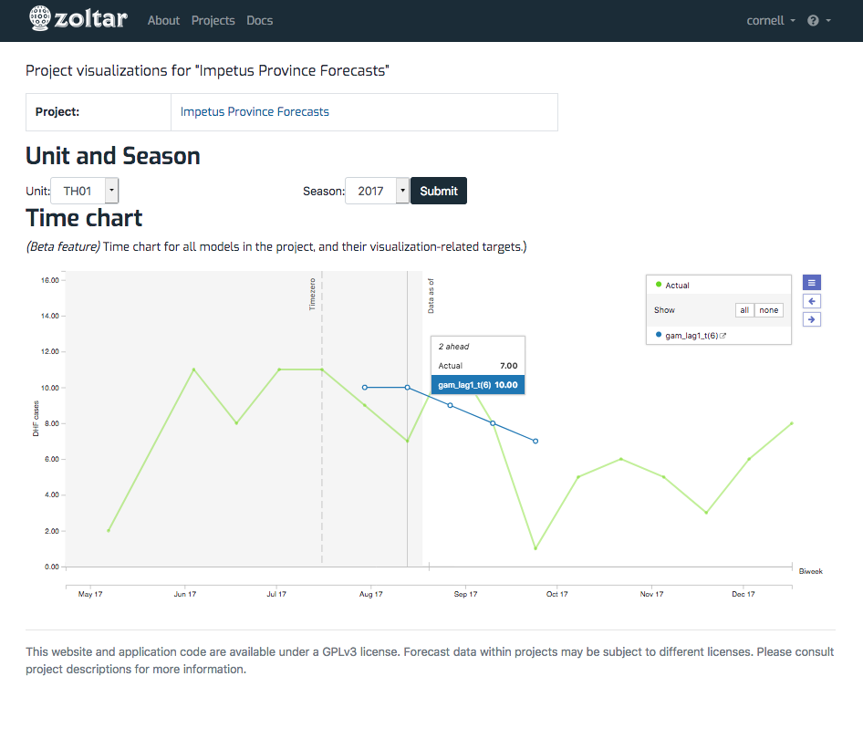

# Zoltar Visualizations

Visualizations are provided for each project and they can be accessed by clicking visualization link on the [project detail page](ProjectDetailPage.md). This page uses the [D3 Foresight component](https://github.com/reichlab/d3-foresight)'s TimeChart to display the project's models' forecasts for each step ahead target. Currently we only use the basic plot feature along with the **actual** component. We plan to add baseline, history, and other features. To use the chart:

1. Select a location and season from the drop downs. (Note that selecting a season will reload the page, which can take a long time for large projects.)
1. Click the plot area to move the current time zero, indicated by the vertical division between gray on the left and white on the right. The plot shows the step ahead target predictions for each model.
1. Hover over the plot to see details.
1. The legend shows model names, and allows showing or hiding them. Hover over a model name for details, and click the link button to show model details in a separate Zoltar page.
1. Click the left and right arrows to the right of the legend to move the current time zero.
1. Click the "hamburger" icon to toggle the legend.

Here's an example visualization page: 

