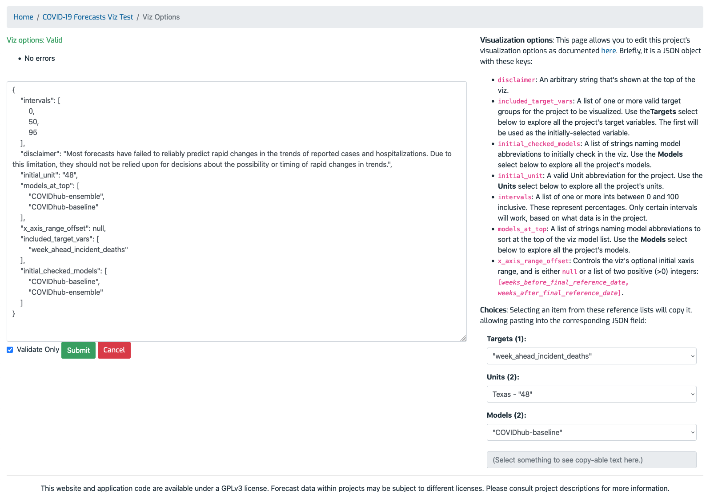

# Visualization options page

> Note: Currently the visualization feature is only available to logged in users. Please see the [contact section](index.md#contact) on the index page for account requests.

Reached via the [project detail page](ProjectDetailPage.md)'s _Features_ section, this page lets you edit project-specific options that the visualization feature requires. These options must be set for the visualization to work properly. They are expressed as a [JSON object](https://www.json.org/json-en.html). The page has these sections (refer to the screenshot below):

- **Validity**: Located in the upper left, this shows the validity of the submitted JSON. Green text indicates valid JSON, and red indicates invalid JSON, along with bullet(s) for each error. You'll need to correct the JSON and re-submit it before it can be saved. 
- **Editor**: Located in the middle left, this is a plain HTML text area where you can edit the JSON. Once you're done, click the "Submit" button to either validate the JSON (check the "Validate Only" box) without saving, or save the JSON (uncheck the box). You'll see the message "Project viz options saved." if the save was successful.
- **Documentation summary**: Located in the upper right, this text summarizes each JSON field's purpose.
- **Choices**: Located in the lower right, this is a set of controls you can use to browse all the Targets, Units, and Models in the project. Selecting an item places its text in the gray text area at the bottom right. You can select the text and then use the brower's copy and paste feature to paste it into the JSON on the left.

## Example page

